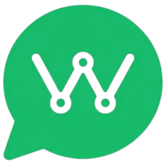
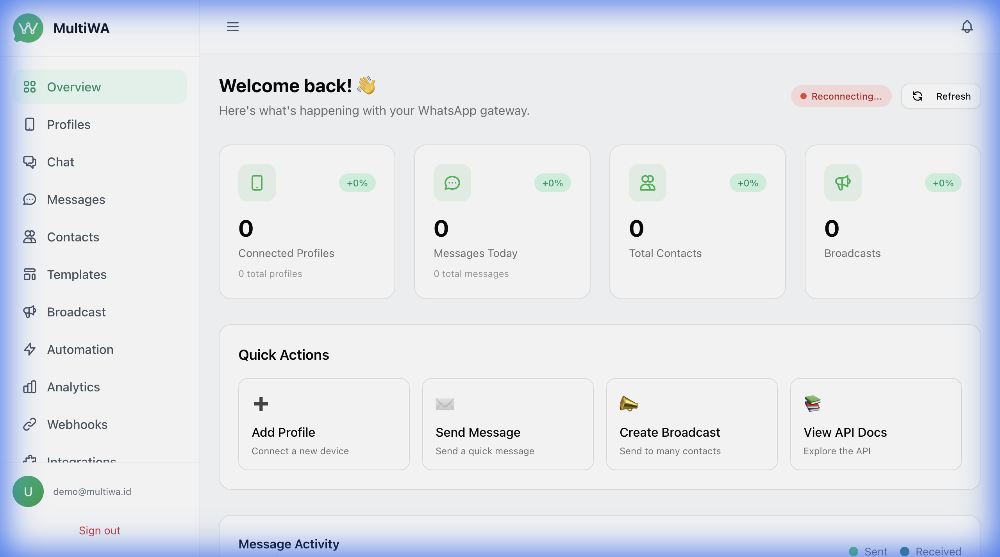
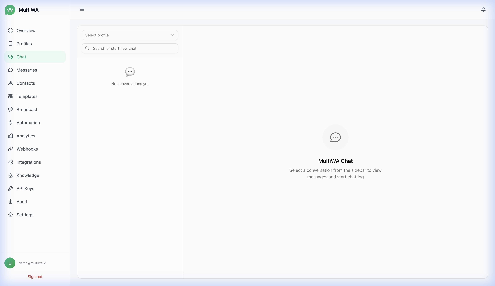
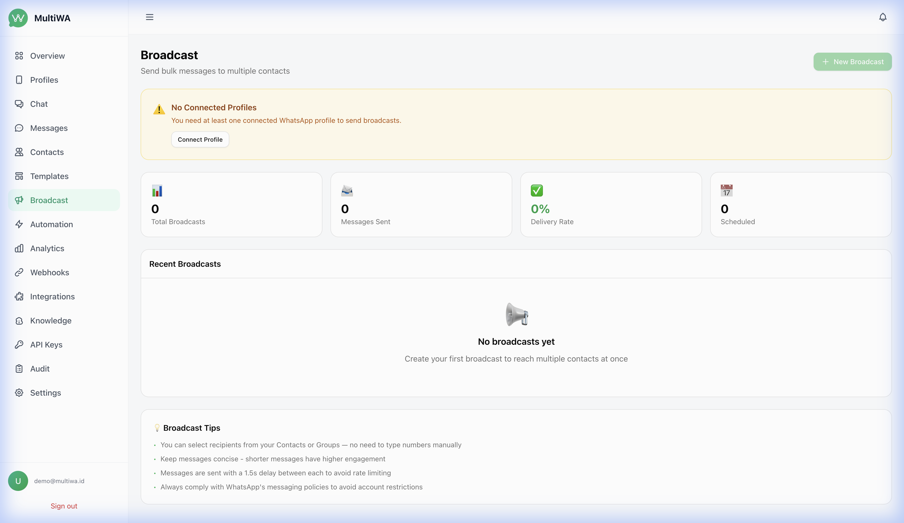
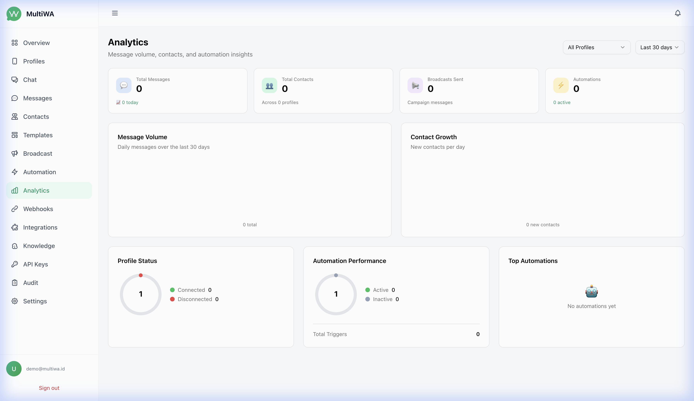

<p align="center">
  
</p>

<h1 align="center">MultiWA</h1>

<p align="center">
  <strong>Open Source WhatsApp Business API Gateway</strong><br />
  Multi-engine • Self-hosted • Enterprise-ready
</p>

<p align="center">
  <a href="LICENSE"></a>
  <a href="CHANGELOG.md"></a>
  <a href="docker-compose.production.yml"></a>
  <a href="https://github.com/ribato22/multiwa/actions/workflows/ci.yml"></a>
  
  <a href="https://buymeacoffee.com/ribato"></a>
  <a href="https://github.com/sponsors/ribato22"></a>
</p>

<p align="center">
  <a href="#-quick-start">Quick Start</a> •
  <a href="#-features">Features</a> •
  <a href="#-screenshots">Screenshots</a> •
  <a href="#-architecture">Architecture</a> •
  <a href="#-api-documentation">API Docs</a> •
  <a href="#-sdks">SDKs</a> •
  <a href="CONTRIBUTING.md">Contributing</a>
</p>

---

## 🎯 What is MultiWA?

**MultiWA** is a fully self-hosted, open-source WhatsApp API gateway that lets you connect multiple WhatsApp numbers through a single unified API. Built for businesses and developers who need reliable WhatsApp messaging without cloud dependencies.

### ✨ Why MultiWA?

| Feature | MultiWA | WhatsApp Cloud API | Evolution API |
|---------|---------|-------------------|---------------|
| **Self-hosted** | ✅ Full control | ❌ Meta-hosted | ✅ |
| **Multi-engine** | ✅ whatsapp-web.js, Baileys | ❌ Single | ❌ Fixed |
| **Admin Dashboard** | ✅ Full-featured | ❌ None | ⚠️ Basic |
| **Visual Automation** | ✅ Drag & drop builder | ❌ | ❌ |
| **Knowledge Base AI** | ✅ OpenAI / Google AI | ❌ | ❌ |
| **Plugin System** | ✅ Extensible | ❌ | ❌ |
| **Free** | ✅ MIT License | ⚠️ Per-message pricing | ✅ |
| **Official SDKs** | ✅ TS, Python, PHP | ✅ Multiple | ⚠️ Community |

---

## 🚀 Quick Start

### Prerequisites

- **Node.js** ≥ 20
- **PostgreSQL** ≥ 16
- **Redis** ≥ 7
- **pnpm** ≥ 9

### Option 1: Docker (Recommended for Production)

```bash
# Clone the repository
git clone https://github.com/ribato22/MultiWA.git
cd MultiWA

# Configure environment
cp .env.production.example .env

# Start all services
docker compose -f docker-compose.production.yml up -d

# API: http://localhost:3333/api/docs
# Admin: http://localhost:3001
```

### Option 2: Local Development

```bash
# Clone and install
git clone https://github.com/ribato22/MultiWA.git
cd MultiWA
pnpm install

# Configure environment
cp .env.example .env

# Setup database
pnpm --filter database exec prisma generate
pnpm --filter database exec prisma migrate deploy

# Build workspace packages
pnpm --filter database build
pnpm --filter engines build

# Start development
pnpm --filter api dev     # API on http://localhost:3000
pnpm --filter admin dev   # Admin on http://localhost:3001
```

---

## ⚡ Features

### Core
- 📱 **Multi-Session Management** — Connect unlimited WhatsApp accounts
- 🔌 **Pluggable Engine Adapters** — Switch between whatsapp-web.js and Baileys
- 📨 **Unified Messaging API** — Send text, media, documents, contacts, locations
- 📡 **Real-time WebSocket** — Live session status, QR codes, and events via Socket.IO
- 🔐 **JWT Authentication** — Secure API access with refresh tokens

### Admin Dashboard
- 🖥️ **Modern UI** — Next.js 14 with dark mode, responsive design
- 💬 **Live Chat** — Real-time chat interface with message history
- 📊 **Analytics** — Message volume, delivery rates, session metrics
- 🔍 **Audit Trail** — Complete logging of all operations

### Automation & AI
- 🤖 **Visual Flow Builder** — Drag & drop automation design
- 🧠 **Knowledge Base** — AI-powered replies using OpenAI or Google AI
- 📅 **Scheduled Messages** — Queue messages for future delivery
- 📢 **Broadcast** — Bulk messaging with templates and tracking

### Integrations
- 🔗 **Webhooks** — Real-time event notifications to your services
- 🔑 **API Keys** — Multiple keys with scoping and expiration
- 📦 **SDKs** — TypeScript, Python, PHP
- 🔔 **Push Notifications** — Browser push via Web Push API
- 📧 **SMTP Email** — Email alerts for critical events

### Enterprise
- 🛡️ **Security** — Helmet, CSP, rate limiting, encryption at rest
- 🐳 **Docker** — Production-ready containers with health checks
- ⚙️ **Worker** — BullMQ background jobs (messages, automation, webhooks, scheduled)
- 🔒 **GDPR** — Data export and deletion endpoints
- 🔌 **Plugin System** — Extend with custom plugins

---

## 📸 Screenshots

<p align="center">
  
  
</p>
<p align="center">
  
  
</p>

<p align="center">
  <a href="docs/screenshots/">View all screenshots →</a>
</p>

---

## 🏗️ Architecture

```
┌─────────────────────────────────────────────────────────┐
│                    Nginx (SSL/Proxy)                     │
├──────────────────────┬──────────────────────────────────┤
│                      │                                  │
│  ┌──────────────┐    │    ┌──────────────────────────┐  │
│  │ Admin (Next.js)│   │    │     API (NestJS/Fastify)  │  │
│  │  Port 3001    │   │    │     Port 3000             │  │
│  └──────────────┘    │    ├──────────────────────────┤  │
│                      │    │  WhatsApp Engine Adapters │  │
│                      │    │  ├─ whatsapp-web.js       │  │
│                      │    │  └─ Baileys               │  │
│                      │    └────────────┬─────────────┘  │
│                      │                 │                 │
│  ┌──────────────┐    │    ┌────────────┴─────────────┐  │
│  │ Worker (BullMQ)│  │    │  PostgreSQL  │   Redis    │  │
│  └──────────────┘    │    └──────────────────────────┘  │
└──────────────────────┴──────────────────────────────────┘
```

### Tech Stack

| Layer | Technology |
|-------|-----------|
| **API** | NestJS 10 + Fastify |
| **Admin** | Next.js 14 + Tailwind CSS |
| **Database** | PostgreSQL 16 + Prisma ORM |
| **Cache/Queue** | Redis 7 + BullMQ |
| **WhatsApp** | whatsapp-web.js / Baileys |
| **Auth** | JWT (access + refresh tokens) |
| **Realtime** | Socket.IO |
| **Container** | Docker + Docker Compose |
| **CI/CD** | GitHub Actions |

---

## 📖 API Documentation

Full interactive API documentation is available at `/api/docs` (Swagger UI).

### Example: Send a Message

```bash
curl -X POST http://localhost:3000/api/v1/messages/send \
  -H "Authorization: Bearer YOUR_TOKEN" \
  -H "Content-Type: application/json" \
  -d '{
    "profileId": "profile-uuid",
    "to": "6281234567890",
    "message": "Hello from MultiWA! 👋"
  }'
```

### Example: Connect a WhatsApp Session

```bash
curl -X POST http://localhost:3000/api/v1/profiles/YOUR_PROFILE_ID/connect \
  -H "Authorization: Bearer YOUR_TOKEN"
```

> 📚 See [full documentation](https://ribato22.github.io/MultiWA/) for detailed guides, API reference, webhook events, and more. Source docs are in the [`docs/`](docs/) directory.

---

## 📦 SDKs

Official SDKs are included in the [`packages/sdk`](packages/sdk) directory:

| Language | Package | Status |
|----------|---------|--------|
| TypeScript/Node.js | `@multiwa/sdk` | ✅ Stable |
| Python | `multiwa-sdk` | ✅ Stable |
| PHP | `multiwa/sdk` | ✅ Stable |

### TypeScript SDK Example

```typescript
import { MultiWA } from '@multiwa/sdk';

const client = new MultiWA({
  baseUrl: 'http://localhost:3000',
  apiKey: 'your-api-key',
});

// Send a message
await client.messages.send({
  profileId: 'profile-uuid',
  to: '6281234567890',
  message: 'Hello! 👋',
});
```

---

## 🗂️ Project Structure

```
MultiWA/
├── apps/
│   ├── api/          # NestJS backend API
│   ├── admin/        # Next.js admin dashboard
│   └── worker/       # BullMQ background worker
├── packages/
│   ├── core/         # Shared types & utilities
│   ├── database/     # Prisma schema & migrations
│   ├── engines/      # WhatsApp engine adapters
│   └── sdk/          # Official SDKs (TS, Python, PHP)
├── plugins/          # Plugin directory
├── docker/           # Dockerfiles (api, admin, worker)
├── docs/             # Documentation (24 guides)
└── scripts/          # Deployment & utility scripts
```

---

## 🐳 Production Deployment

Detailed deployment guide: [`docs/16-deployment-docker.md`](docs/16-deployment-docker.md)

```bash
# 1. Clone and configure
git clone https://github.com/ribato22/MultiWA.git
cd MultiWA
cp .env.production.example .env
# Edit .env with your settings

# 2. Build and start
docker compose -f docker-compose.production.yml up -d --build

# 3. Run database migrations
docker exec multiwa-api npx prisma migrate deploy --schema=packages/database/prisma/schema.prisma

# 4. Access
# API:    http://your-server:3333/api/docs
# Admin:  http://your-server:3001
```

---

## 🤝 Contributing

Contributions are welcome! See [CONTRIBUTING.md](CONTRIBUTING.md) for guidelines.

1. Fork the repository
2. Create your feature branch (`git checkout -b feature/amazing-feature`)
3. Commit your changes (`git commit -m 'feat: add amazing feature'`)
4. Push to the branch (`git push origin feature/amazing-feature`)
5. Open a Pull Request

---

## 📄 License

This project is licensed under the **MIT License** — see the [LICENSE](LICENSE) file for details.

---

## 🔗 Links

- 📖 [Documentation](https://ribato22.github.io/MultiWA/) · [Source](docs/)
- 🐛 [Report a Bug](https://github.com/ribato22/MultiWA/issues/new?template=bug_report.yml)
- 💡 [Request a Feature](https://github.com/ribato22/MultiWA/issues/new?template=feature_request.yml)
- 🔒 [Security Policy](SECURITY.md)
- 📝 [Changelog](CHANGELOG.md)
- 🕵️ [Privacy Policy](PRIVACY.md)

---

<p align="center">
  Made with ❤️ by the <a href="https://github.com/ribato22">MultiWA</a> team
</p>
